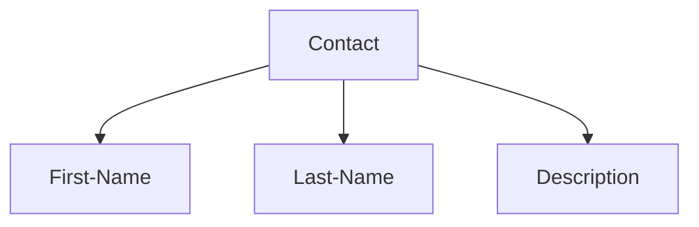
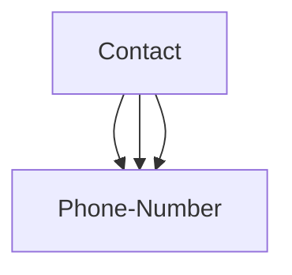

# Phone Book

This site is an audience management system. Where some contact details are stored. These specifications include code name and description description.

- Project link in [Github](https://github.com/Danielmrg/PhoneBook)
- Project link in [Online](http://programer24.pythonanywhere.com/)

[[_TOC_]]

## Prototype

## About first page (main page)

this here we can see any contact an we can search is this page 

## Create new contact

Here it receives and stores the user details and transfers the user to another page.

## Add phone number for contact

In this part you will receive the contact's phone number and then it will take you to the main page.

## About how its works

Each contact has a first and last name. But it can have one or more phone numbers.

## Equipment was used.

- [x] Equipment was used.
  - [x] Framework Backend: Django
  - [x] Frontend : Html , Css , Js and bootstrap4
  - [x] Host : python anywhere

## Team

 - [x] @DanielMRG 
